# Methodology Report: AI-Powered CI/CD Build Failure Prediction Framework

**Dissertation:** AI-Powered Intelligent Framework for CI/CD Pipeline Optimization and Visualization  
**Reference benchmark:** Al-Barhami et al. (2026) — 95.9% accuracy on TravisTorrent with multi-class XGBoost.

This document describes the end-to-end methodology: dataset, data exploration, data processing, model training, explainability (SHAP), and deployment via an interactive dashboard. All tasks, models, and artifacts are covered with references to figures generated by the notebooks.

---

## 1. Dataset and Problem Definition

### 1.1 Data Source

The framework uses the **TravisTorrent** dataset: a well-established academic benchmark of historical Travis CI build records from thousands of GitHub projects. The data are publicly available (e.g., Zenodo) and contain millions of rows with columns describing build outcomes, durations, commit sizes, test results, timestamps, and project metadata. The dataset is the same as that used by Al-Barhami et al. (2026), enabling direct comparison to the 95.9% accuracy benchmark.

### 1.2 Target Variable and Task

The target variable is **build status** (`tr_status`), with four classes:

- **passed** — build completed successfully  
- **failed** — build failed (e.g., tests failed)  
- **errored** — build errored (e.g., infrastructure or configuration failure)  
- **canceled** — build was canceled  

The task is **multi-class classification**: predict the outcome of a CI build from engineered features. The pipeline is implemented in five Jupyter notebooks (01–05) and a Streamlit dashboard; all heavy computation is performed in the notebooks and saved to disk; the dashboard only loads and visualizes.

---

## 2. Data Exploration (Notebook 01)

### 2.1 Purpose and Tasks

Notebook 01 (**Data Overview**) performs exploratory data analysis on the raw CSV **without any transformation**. Its goals are to:

- Inspect shape, columns, and data types  
- Quantify missing values per column (as percentages)  
- Visualize the distribution of the target variable  
- Examine key numeric features (build duration, commits, lines changed)  
- Assess missingness patterns and correlations among numeric columns  

All plots are saved under `reports/figures/` for use in the dissertation and in this report.

### 2.2 Load and Schema

The raw data are loaded from `data/raw/final-2017-01-25.csv`. The schema includes 66 columns, including identifiers (`tr_build_id`, `gh_project_name`), build metadata (`tr_duration`, `tr_status`, `gh_build_started_at`), commit and churn metrics (`git_num_all_built_commits`, `git_diff_src_churn`, `git_diff_test_churn`), test logs (`tr_log_num_tests_ok`, `tr_log_num_tests_run`), and project attributes (`gh_lang`, `gh_team_size`, `gh_sloc`, `gh_repo_age`). Column presence is checked in later steps so that different TravisTorrent versions (e.g., from Zenodo) remain supported.

### 2.3 Target Distribution

The distribution of `tr_status` is highly imbalanced: “passed” dominates, followed by “failed” and “errored,” with “canceled” and rare statuses (e.g., “started”) having few samples. Two visualizations are produced:

- **Bar chart** of class counts → `reports/figures/01_target_bar.png`  
- **Pie chart** of class proportions → `reports/figures/01_target_pie.png`  

**Figure 1 (Target bar):** `reports/figures/01_target_bar.png`  

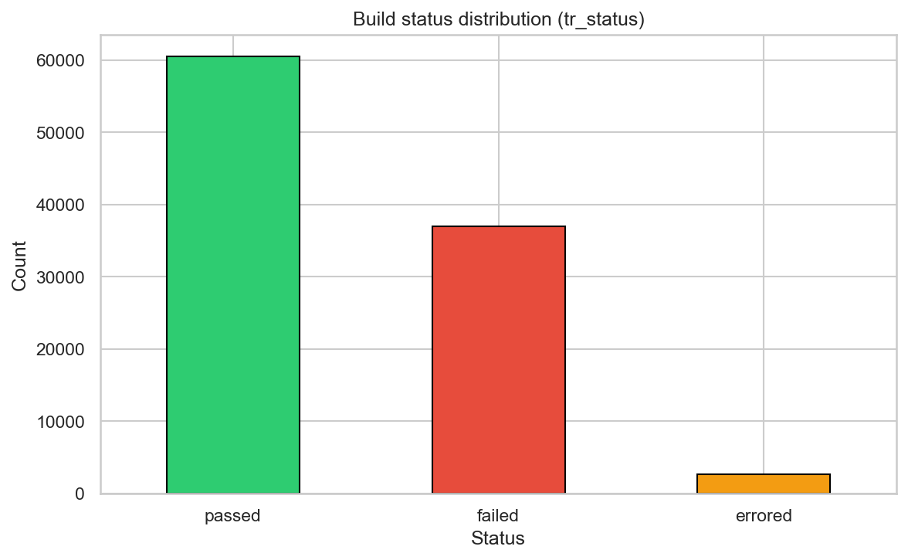

**Figure 2 (Target pie):** `reports/figures/01_target_pie.png`

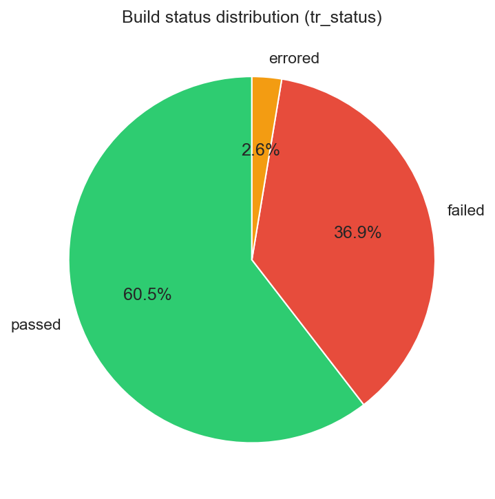

### 2.4 Key Numeric Features

Histograms are generated for variables that the literature identifies as predictive of build outcome:

- Build duration (e.g., `tr_duration`)  
- Number of commits per build  
- Lines of code changed (from churn columns)

These are saved as a single figure: **`reports/figures/01_histograms_key_features.png`**.

**Figure 3 (Histograms):** `reports/figures/01_histograms_key_features.png`

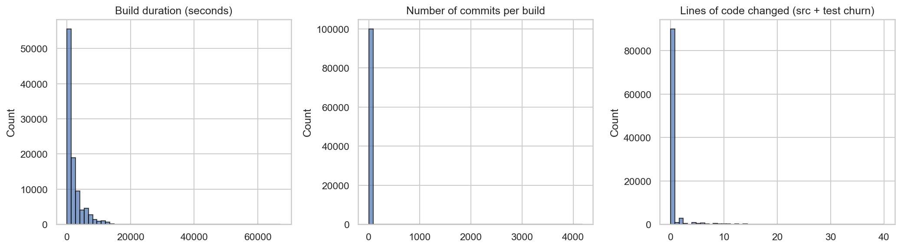

### 2.5 Missing Values and Correlation

- A **null heatmap** highlights columns with non-trivial missingness → `reports/figures/01_null_heatmap.png`  
- A **correlation matrix** for numeric columns supports feature selection and interpretation → `reports/figures/01_correlation_matrix.png`  

**Figure 4 (Null heatmap):** `reports/figures/01_null_heatmap.png`  

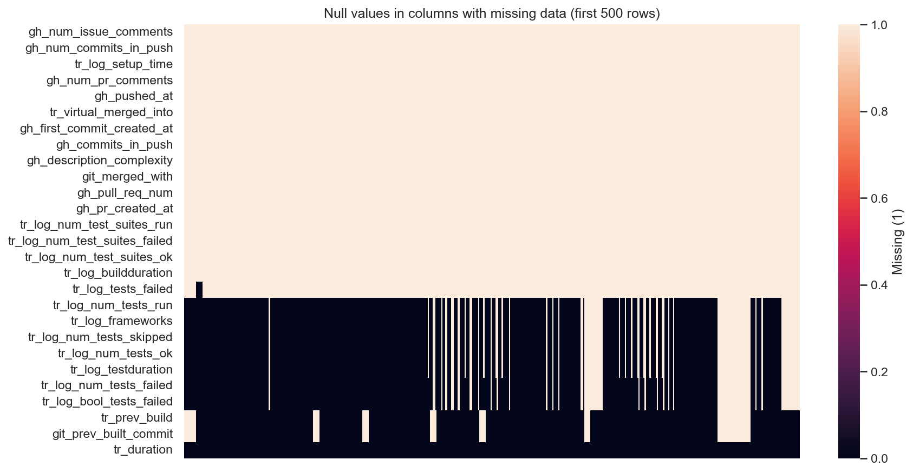

**Figure 5 (Correlation matrix):** `reports/figures/01_correlation_matrix.png`

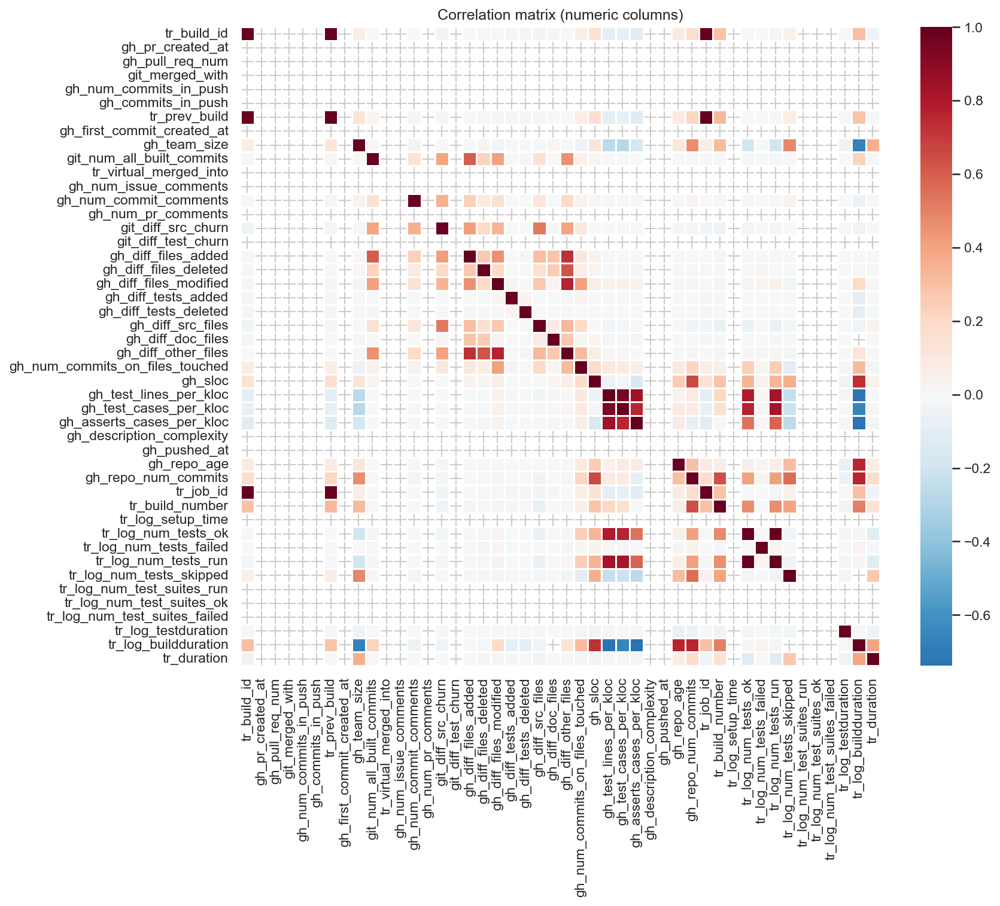

### 2.6 Summary Output

The notebook ends with a printed summary of shape, target distribution, number of columns with high missingness (>10% and >50%), and the key numeric columns used in later modeling. No transformation or cleaning is applied in this notebook.

---

## 3. Data Processing and Feature Engineering (Notebook 02)

### 3.1 Purpose and Tasks

Notebook 02 (**Data Processing**) turns the raw data into a model-ready dataset. It:

- Loads the full (or configurable) raw CSV with `low_memory=False` to avoid DtypeWarnings  
- Engineers features in a robust way (checks for column existence before use)  
- Filters to the four main target classes (passed, failed, errored, canceled) for stratified splitting  
- Fills missing values and encodes categoricals and the target  
- Splits data into train / validation / test and saves all artifacts  

Feature engineering follows the literature (e.g., Kumar et al., 2025) on predictive signals in CI/CD data.

### 3.2 Feature Engineering (src/preprocessing.py)

The following features are produced (when the corresponding source columns exist):

| Feature | Description | Source / logic |
|--------|-------------|----------------|
| `build_duration_sec` | Build duration in seconds, clipped at 99th percentile | `tr_duration` or `tr_log_buildduration` |
| `commits_per_build` | Number of commits in the build | `git_num_all_built_commits` or `gh_num_commits_in_push` |
| `loc_changed` | Lines of code changed | `git_diff_src_churn` + `git_diff_test_churn` |
| `hour_of_day` | Hour of build start (0–23) | `gh_build_started_at` |
| `day_of_week` | Day of week (0–6) | `gh_build_started_at` |
| `is_weekend` | Binary weekend flag | Derived from `day_of_week` |
| `test_pass_rate` | Passing tests / total tests; 1.0 if no tests run | `tr_log_num_tests_ok`, `tr_log_num_tests_run` |
| `previous_build_failed` | Whether the previous build (by `tr_prev_build`) failed or errored | `tr_prev_build`, `tr_status` |
| `tests_run_log` | log(1 + number of tests run) | `tr_log_num_tests_run` (optional) |
| `gh_team_size` | Number of contributors | `gh_team_size` (optional) |
| `gh_sloc_log` | log(1 + source lines of code) | `gh_sloc` (optional) |
| `gh_repo_age` | Repository age measure | `gh_repo_age` (optional) |
| `gh_lang_enc` | Label-encoded programming language | `gh_lang` |

The pipeline is robust to missing columns: optional features are skipped with warnings, and only features present in the processed DataFrame are used for modeling.

### 3.3 Missing Values and Encoding

- **Numeric columns:** Missing values are filled with the column median.  
- **Categorical columns:** `gh_lang` is label-encoded to `gh_lang_enc`; unknown/missing mapped to a single category.  
- **Target:** String labels are encoded to integers via a `LabelEncoder`; the mapping is stored in `models/encoders.joblib` for inverse mapping in the dashboard and reports.

### 3.4 Train / Validation / Test Split

- **Proportions:** 70% train, 15% validation, 15% test.  
- **Stratification:** By the (encoded) target so that class proportions are preserved in each set.  
- **Filtering:** Rows with target not in {passed, failed, errored, canceled} (e.g., “started”) are dropped before the split so that stratified splitting has at least two samples per class in each fold.

### 3.5 Saved Artifacts

- `data/processed/X_train.csv`, `X_val.csv`, `X_test.csv` — feature matrices  
- `data/processed/y_train.npy`, `y_val.npy`, `y_test.npy` — encoded labels  
- `models/encoders.joblib` — `target_encoder`, `lang_encoder`, `feature_list`, `class_names`  

Downstream notebooks (03, 04) and the dashboard load these artifacts and do not re-run processing.

---

## 4. Model Training (Notebook 03)

### 4.1 Purpose and Tasks

Notebook 03 (**Model Training**) trains an XGBoost multi-class classifier and evaluates it. The choice of XGBoost is motivated by the dissertation literature (Al-Barhami et al., 2026) as a top-performing model for this tabular CI/CD setting. The notebook:

- Loads train/validation/test data and encoders from disk  
- Trains a **baseline** model (fixed hyperparameters)  
- Runs **hyperparameter search** with RandomizedSearchCV  
- Trains a **final model** with the best hyperparameters and early stopping  
- Evaluates on the **test set** (accuracy, F1, classification report, confusion matrix)  
- Produces **feature importance** and **learning curves**  
- Saves the trained model and metrics  

Class imbalance is addressed via **sample weights** (`class_weight='balanced'`) in XGBoost rather than oversampling, to avoid duplicating data and to use XGBoost’s native support.

### 4.2 Baseline Model

A baseline XGBoost classifier is trained with:

- `n_estimators=100`, `max_depth=6`, `learning_rate=0.1`  
- `objective='multi:softprob'`, `num_class=4`, `eval_metric='mlogloss'`  
- Sample weights for balanced classes  

Validation accuracy of this baseline is reported as a reference before tuning.

### 4.3 Hyperparameter Search

**RandomizedSearchCV** is used over a search space that includes:

- `n_estimators`, `max_depth`, `learning_rate`, `min_child_weight`, `gamma`  
- `subsample`, `colsample_bytree`, `reg_alpha`, `reg_lambda`  

Search is run with multiple candidates (e.g., 72) and 3-fold cross-validation, scoring by **accuracy**. The best parameters and best CV score are recorded. Training uses the same feature matrix and sample weights as the final model.

### 4.4 Final Model and Early Stopping

The best hyperparameters from the search are used to train a **final** XGBoost model with:

- A larger `n_estimators` (e.g., up to 800) and **early stopping** on the validation set (e.g., `early_stopping_rounds=25`) to reduce overfitting.  
- Evaluation on the validation set after training to report validation accuracy and best iteration.

The trained model is saved to `models/build_failure_model.pkl`.

### 4.5 Test Set Evaluation

The best model is evaluated on the held-out **test set**:

- **Accuracy** — compared in the notebook and dashboard to the 95.9% benchmark.  
- **Weighted F1** — reported as the main metric for imbalanced multi-class.  
- **Classification report** — precision, recall, F1, and support per class.  
- **Confusion matrix** — counts (and optionally percentages).  

These results are also stored in `models/metrics.joblib` (e.g., `accuracy`, `f1_weighted`, `class_names`) for the dashboard.

### 4.6 Confusion Matrix Figure

The confusion matrix is plotted as a heatmap and saved as:

**Figure 6 (Confusion matrix):** `reports/figures/03_confusion_matrix.png`

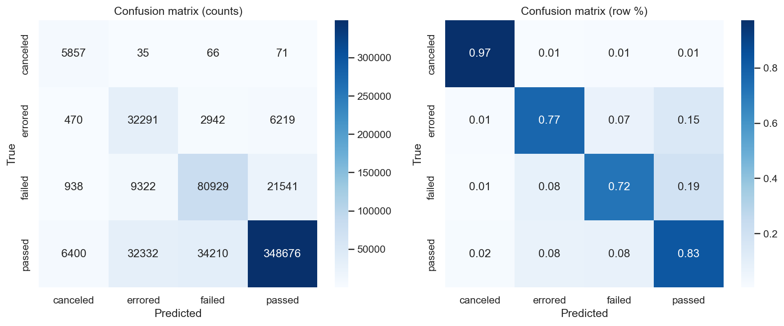

### 4.7 Feature Importance

XGBoost’s built-in feature importance (gain) is plotted as a bar chart to show which features the model relies on most:

**Figure 7 (Feature importance):** `reports/figures/03_feature_importance.png`

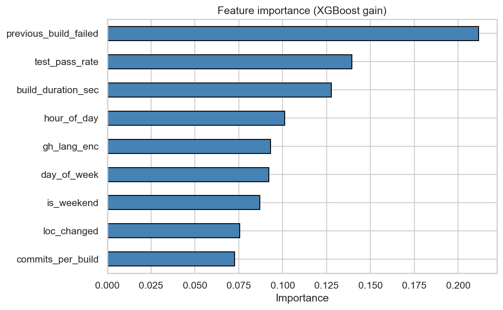

### 4.8 Learning Curves

Learning curves (training and validation score vs. training set size) are computed with the same model configuration and 3-fold CV, then plotted to assess bias/variance and data scaling:

**Figure 8 (Learning curves):** `reports/figures/03_learning_curves.png`

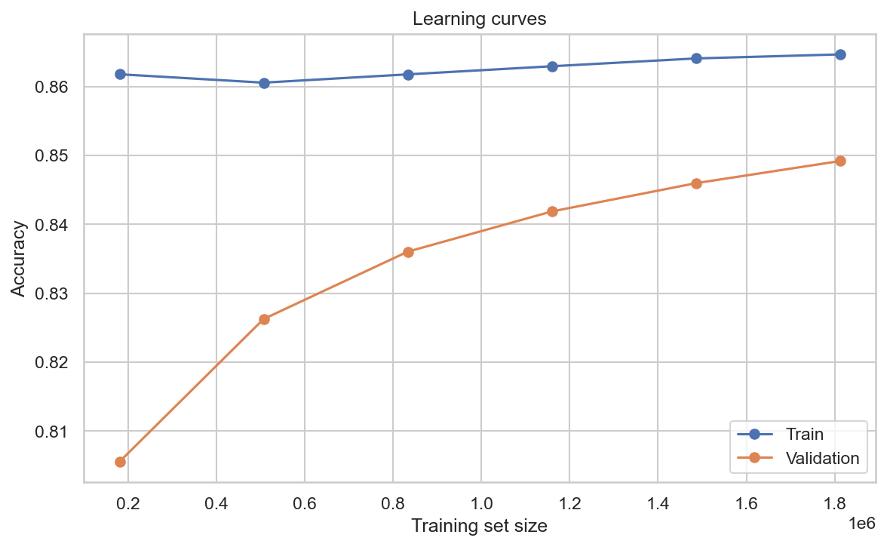

---

## 5. SHAP Explainability (Notebook 04)

### 5.1 Purpose and Tasks

Notebook 04 (**SHAP Explainability**) adds the explainable AI (XAI) layer so that predictions can be interpreted. SHAP is used in line with Sami et al. (2025) and the dissertation’s research gap on real-time, human-understandable explanations in AIOps. The notebook:

- Loads the trained model and a **sample** of the test set (e.g., 500 or 2000 rows) to keep SHAP computation tractable  
- Builds a **TreeExplainer** (with a small background if desired) and computes SHAP values for the sample  
- Produces **global** and **local** visualizations and saves them  
- Saves SHAP values, sample data, feature list, class names, and expected values to `models/shap_data.joblib` for the dashboard  

### 5.2 SHAP Value Computation

- **Explainer:** `shap.TreeExplainer(model, background)` with a small background (e.g., 100 rows) to keep initialization fast.  
- **Values:** `explainer.shap_values(X_sample)` yields, for multi-class XGBoost, a list of arrays (one per class) of shape `(n_sample, n_features)`. The notebook normalizes 3D output to this list form when necessary.  

Runtime is roughly linear in sample size; reducing the sample (e.g., to 500) significantly shortens the run.

### 5.3 Global Summary (Bar)

Mean absolute SHAP value per feature, per class, is plotted as a bar chart:

**Figure 9 (SHAP summary bar):** `reports/figures/04_shap_summary_bar.png`

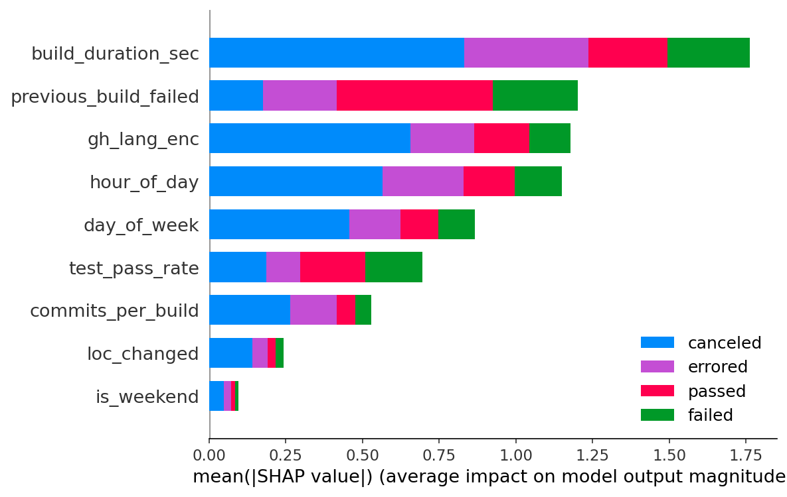

### 5.4 Beeswarm Plot (Failed Class)

For the “failed” class, a beeswarm plot shows the direction and magnitude of each feature’s impact across the sample:

**Figure 10 (SHAP beeswarm — failed):** `reports/figures/04_shap_beeswarm_failed.png`

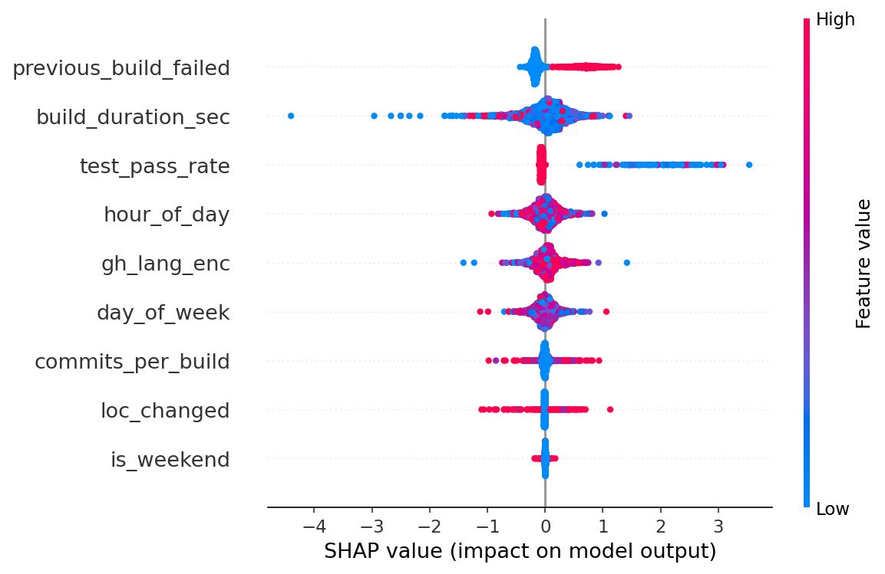

### 5.5 Waterfall Plot (Single Failed Build)

A single representative failed build is explained with a waterfall plot (step-by-step contribution of each feature from baseline to prediction):

**Figure 11 (SHAP waterfall — failed):** `reports/figures/04_shap_waterfall_failed.png`

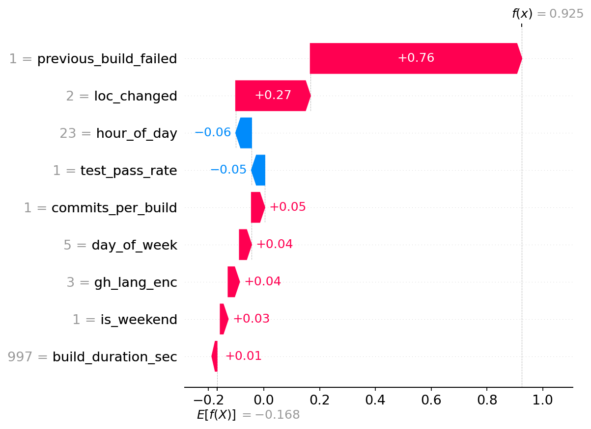

### 5.6 Dependence Plot (Top Feature)

A dependence plot for the top-importance feature shows how its value relates to its SHAP effect:

**Figure 12 (SHAP dependence — top feature):** `reports/figures/04_shap_dependence_top.png`

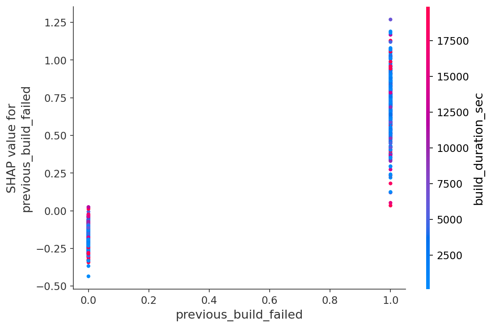

### 5.7 Saved SHAP Artifacts

- `models/shap_data.joblib` contains: `shap_values`, `X_sample`, `feature_list`, `class_names`, `expected_value`, and any other data needed by the dashboard. The explainer is recreated in the dashboard from the model and `X_sample`.

---

## 6. Dashboard Preview (Notebook 05)

Notebook 05 (**Dashboard Preview**) is a lightweight sanity check: it loads the saved model and SHAP data and renders key visualizations (e.g., summary bar, waterfall) inline. It does not replace the Streamlit dashboard but verifies that artifacts and plotting code work correctly before running the full app.

---

## 7. Streamlit Dashboard (dashboard/app.py)

### 7.1 Purpose and How It Is Used

The dashboard is the main **deployment-facing** interface. It is used to:

- Inspect dataset overview and model performance without re-running notebooks  
- Explore SHAP explanations by class and by build index  
- Run **live predictions**: the user enters feature values, gets a predicted class and per-class probabilities, and a **SHAP waterfall** explaining that single prediction (human-in-the-loop use case)

All heavy computation (training, SHAP on a large sample) is done in the notebooks; the dashboard only loads precomputed artifacts and, for live prediction, runs a single forward pass and single-instance SHAP.

### 7.2 Structure and Caching

- **Sidebar:** Displays model accuracy and weighted F1 (from `metrics.joblib`), dataset name, class list, and the Al-Barhami et al. (2026) reference.  
- **Tabs:**  
  - **Dataset Overview:** Test set size, class distribution bar chart, feature summary statistics.  
  - **Model Performance:** Accuracy, F1, classification report, confusion matrix heatmap (aligned with Figure 6).  
  - **SHAP Explainability:** Class selector, global summary bar for the chosen class, slider to pick a build index, and waterfall plot for that build.  
  - **Live Prediction:** Inputs for each feature (or defaults from the SHAP sample), “Predict” button, predicted class and probabilities, and SHAP waterfall for the entered instance.  

- **Caching:** `@st.cache_data` or `@st.cache_resource` is used for loading splits, encoders, model, metrics, and SHAP data so that repeated navigation does not reload from disk unnecessarily.

### 7.3 How to Run

From the project root:

```bash
streamlit run dashboard/app.py
```

The app expects that notebooks 02, 03, and 04 have been run so that `data/processed/`, `models/build_failure_model.pkl`, `models/metrics.joblib`, and `models/shap_data.joblib` exist.

---

## 8. Summary of All Jobs and Artifacts

| Step | Notebook / code | Main job | Outputs |
|------|------------------|----------|---------|
| 1 | Notebook 01 | Load raw CSV; EDA; plot target, histograms, null heatmap, correlation | Figures: 01_target_bar, 01_target_pie, 01_histograms_key_features, 01_null_heatmap, 01_correlation_matrix |
| 2 | Notebook 02 + src/preprocessing.py | Feature engineering; fill/encode; stratified 70/15/15 split | X_train/val/test.csv, y_*.npy, encoders.joblib |
| 3 | Notebook 03 | Baseline → RandomizedSearchCV → final model with early stopping; evaluation; importance & learning curves | build_failure_model.pkl, metrics.joblib; Figures: 03_confusion_matrix, 03_feature_importance, 03_learning_curves |
| 4 | Notebook 04 | TreeExplainer; SHAP on sample; global/local plots | shap_data.joblib; Figures: 04_shap_summary_bar, 04_shap_beeswarm_failed, 04_shap_waterfall_failed, 04_shap_dependence_top |
| 5 | Notebook 05 | Load model + SHAP data; inline preview of key plots | — (sanity check only) |
| 6 | dashboard/app.py | Load artifacts; serve Dataset, Performance, SHAP, Live Prediction tabs | — (interactive app) |

---

## 9. Reference List of Figures

All figures are under `reports/figures/` relative to the project root:

| # | Description | Path |
|---|-------------|------|
| 1 | Target distribution (bar) | `reports/figures/01_target_bar.png` |
| 2 | Target distribution (pie) | `reports/figures/01_target_pie.png` |
| 3 | Histograms of key numeric features | `reports/figures/01_histograms_key_features.png` |
| 4 | Null value heatmap | `reports/figures/01_null_heatmap.png` |
| 5 | Correlation matrix | `reports/figures/01_correlation_matrix.png` |
| 6 | Confusion matrix (test set) | `reports/figures/03_confusion_matrix.png` |
| 7 | Feature importance (XGBoost gain) | `reports/figures/03_feature_importance.png` |
| 8 | Learning curves | `reports/figures/03_learning_curves.png` |
| 9 | SHAP global summary (bar) | `reports/figures/04_shap_summary_bar.png` |
| 10 | SHAP beeswarm (failed class) | `reports/figures/04_shap_beeswarm_failed.png` |
| 11 | SHAP waterfall (one failed build) | `reports/figures/04_shap_waterfall_failed.png` |
| 12 | SHAP dependence (top feature) | `reports/figures/04_shap_dependence_top.png` |

---

## 10. References (in-text)

- **Al-Barhami et al. (2026)** — Multi-class XGBoost on TravisTorrent; 95.9% accuracy benchmark.  
- **Kumar et al. (2025)** — Predictive features in CI/CD data (duration, commits, churn, temporal, test pass rate, consecutive failure).  
- **Sami et al. (2025)** — SHAP and explainability in AIOps dashboards for trust and operational use.

---

*Generated for the dissertation “AI-Powered Intelligent Framework for CI/CD Pipeline Optimization and Visualization.” All methodology steps, models, jobs, and figure paths are as implemented in the notebooks and dashboard.*
